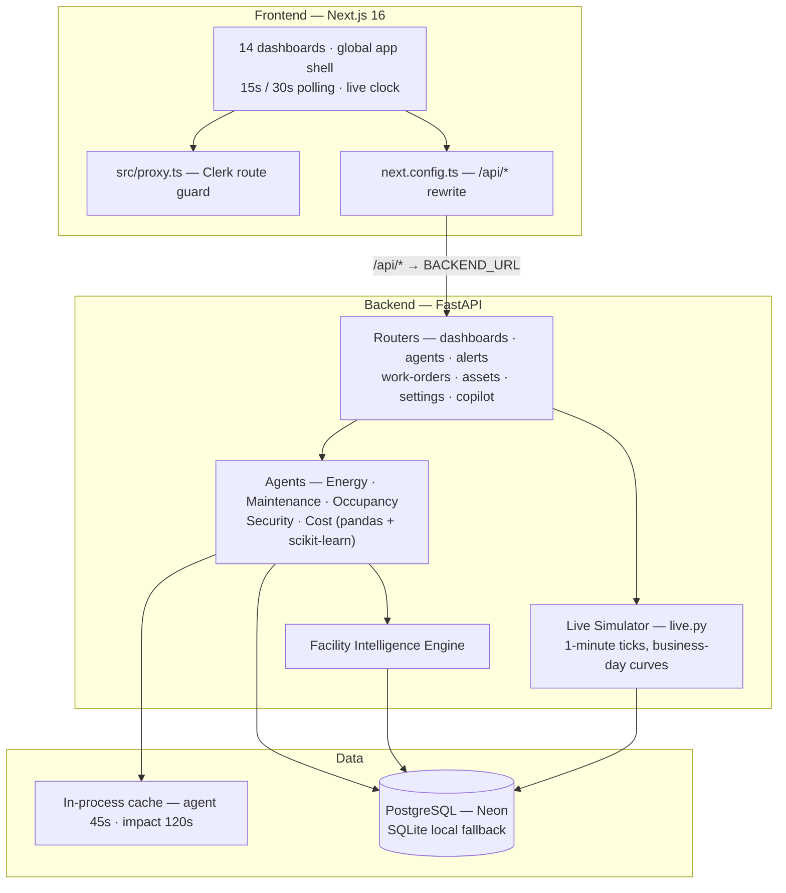
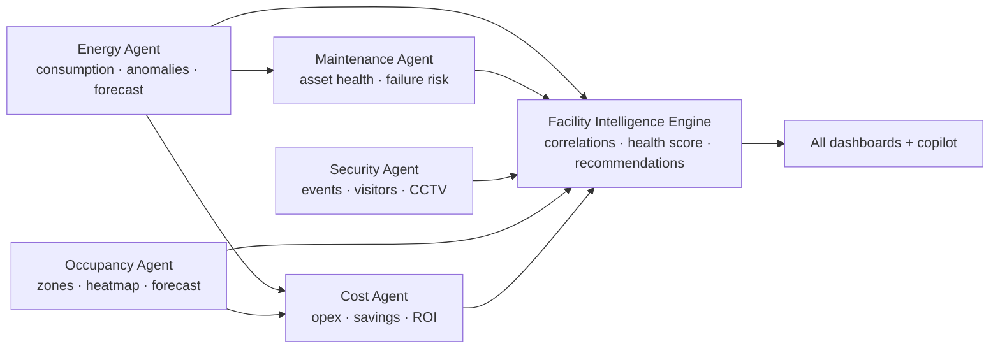
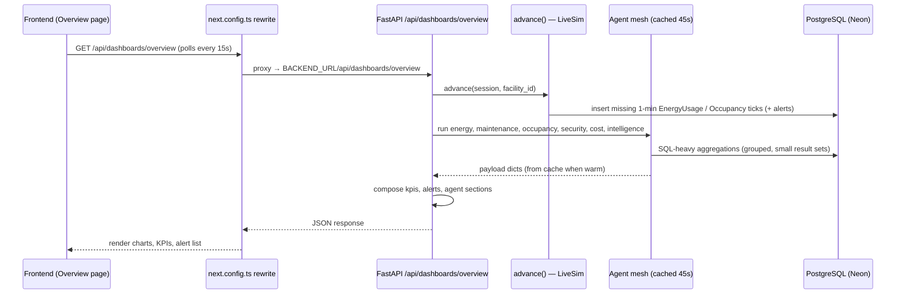

# Architecture

Deep-dive on how the Agentic FacilityOps AI Platform is put together — every
layer, how a request flows through it, and how the agents collaborate.

- **Frontend:** Next.js 16 app shell (14 pages), Clerk auth, `/api/*` proxy rewrite
- **Backend:** FastAPI routers that run a mesh of 6 Python agents (pandas + scikit-learn)
- **Data:** PostgreSQL (Neon) shared across local dev and production
- **Live layer:** a deterministic simulator that appends 1-minute readings so the demo is alive

> Every number on every screen is **computed at runtime from the database**. No KPI is
> hardcoded, pinned to a spec constant, or fabricated in the frontend.

---

## 1. System overview

**Key files**

| Concern | Location |
|---------|----------|
| Frontend app shell, pages, data hook | `src/app/`, `src/components/`, `src/lib/api.ts` |
| Clerk route guard (Next.js 16) | `src/proxy.ts` |
| API proxy to backend | `next.config.ts` |
| FastAPI entry + lifespan + `/api/health` | `backend/app/main.py` |
| Routers (one per resource) | `backend/app/routers/` |
| Agents (compute engine) | `backend/app/agents/` |
| Live simulator | `backend/app/live.py` |
| Seed dataset | `backend/app/seed.py` |
| Models (16 tables) | `backend/app/models.py` |
| Config store + cache + impact estimates | `backend/app/config_store.py`, `cache.py`, `impact.py` |

---

## 2. Frontend layer

- **App shell** — collapsible sidebar (`Sidebar.tsx`), topbar with facility selector,
  live clock, alert bell, theme toggle, user menu (`Topbar.tsx`). Shared by all 14 pages
  via `src/app/(app)/layout.tsx`.
- **Auth** — `src/proxy.ts` uses `clerkMiddleware`; every route except `/sign-in`,
  `/sign-up`, `/user` calls `auth.protect()`. Unauthenticated users are redirected to
  Clerk's hosted sign-in.
- **API proxying** — `next.config.ts` rewrites `/api/:path*` to `BACKEND_URL/api/:path*`
  (default `http://127.0.0.1:8000`), so the browser only ever talks to the frontend origin.
- **Data hook** — `useApiData(path, fallback, intervalMs)` in `src/lib/api.ts` fetches with
  `cache: "no-store"`, polls every `intervalMs` when given, and exposes `{ data, loading, error, refresh }`.
  Dashboards + topbar poll every **15s**; Assets/WorkOrders/Copilot/Settings poll every **30s**.
- **Charts** — lightweight custom SVG chart components (`src/components/charts/`): area, bars,
  donut, gauge, heatmap — no heavy chart library.

---

## 3. Backend layer

FastAPI app created in `main.py` with a lifespan that:

1. runs `init_db()` (creates all tables),
2. seeds the database on first boot (when there are no facilities),
3. mounts CORS for `localhost:3000`,
4. registers all routers via `include_routers(app)`.

### 3.1 Routers

| Router | Prefix | Responsibilities |
|--------|--------|------------------|
| `dashboards.py` | `/api/dashboards` | Per-page payloads — runs the agent mesh and shapes the response |
| `agents.py` | `/api/agents` | Agent registry, list, and `/{id}/run` |
| `alerts.py` | `/api/alerts` | Alerts list/summary/status PATCH |
| `work_orders.py` | `/api/work-orders` | Work order CRUD + technician roster |
| `assets.py` | `/api/assets` | Asset list/detail (+ failure prediction) |
| `settings.py` | `/api/settings` | Config, integrations, agent thresholds, facility, team |
| `copilot.py` | `/api/copilot` | Deterministic AI copilot chat + agent collaboration |

### 3.2 Agent mesh

Six agent modules each expose a `run(session, facility_id) -> dict` function.
Agent outputs are **cached 45s** per `(agent, facility_id)`; impact estimates are
**cached 120s** per `(agent, title)`.

Cross-agent dependencies (computed live, not pinned):

| Dependency | What it feeds |
|-----------|---------------|
| `energy.run` | Cost agent realized savings; intelligence correlations & anomaly feed; copilot factoids |
| `maintenance.run` | Cost agent cost-avoidance; intelligence top-risk asset; copilot factoids |
| `occupancy.run` | Intelligence correlation (energy × occupancy); copilot factoids |
| `security.run` | Intelligence security health + anomaly feed; copilot factoids |
| `cost.run` | Intelligence `optimizations`, `roi_multiple`; reports scorecards |

### 3.3 Live simulator (`live.py`)

Every dashboard request calls `advance(session, facility_id)` **before** computing the
payload. `advance` generates the missing 1-minute ticks between the last stored reading
and the current wall clock:

- `EnergyUsage` — minute-level kWh (diurnal curve + noise, live HVAC/lighting/equipment split)
- `OccupancyRecord` — per-zone snapshot each minute (4 zones: Office Floors / Meeting Rooms / Common Areas / Parking)
- `SecurityEvent` — probabilistic incidents (~1.2% per minute, ~1/hour across the day)
- `Alert` — auto-created when a live threshold is crossed (energy deviation, occupancy crowding, Red security event)

Generation is **deterministic per `(facility_id, timestamp)`** (seeded RNG), so retries and
multiple workers produce identical rows. Catch-up is capped (default 1440 min) to avoid
database blowups after long downtime.

---

## 4. Request lifecycle (example: Facility Operations Dashboard)

---

## 5. Data provenance & performance

- **No fabricated KPIs** — every headline (MWh, facility health, ROI, cost reduction,
  occupancy %, failure risk) is computed by the agents from live database rows.
  Configuration values (tariffs, targets, thresholds, ROI multiple) come from the
  `system_config` table as *constants* in those formulas.
- **SQL-first aggregation** — heavy work (daily/hourly sums, baselines, heatmaps,
  correlations) is pushed into grouped SQL so only small result sets cross the
  (bandwidth-limited) Neon connection.
- **Cache coherency** — all agents share the same TTL, so one Overview request and a
  simultaneous Copilot request produce internally consistent numbers for the same poll window.
- **Sample-data labeling** — `/api/health` returns `sample_note` (from `system_config`),
  and the topbar renders a backend-driven **"Sample Data"** badge so the synthetic dataset
  is never misrepresented as real telemetry.

See [WORKFLOW.md](./WORKFLOW.md) for the end-to-end data journey and
[EDGE_CASES.md](./EDGE_CASES.md) for known behaviors and gotchas.
