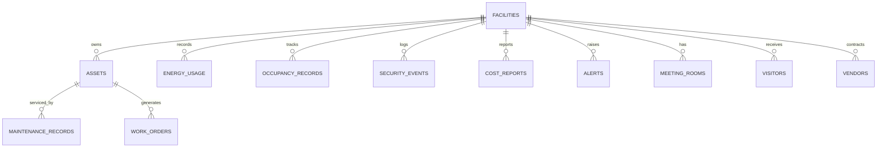

# Database Schema

All tables are defined as SQLAlchemy 2.0 models in `backend/app/models.py` and created
with `Base.metadata.create_all()` on startup. The database is **PostgreSQL on Neon**
(shared across local dev and production); if `DATABASE_URL` is unset it falls back to a
local SQLite file at `backend/data/facilityops.db`.

> There are **16 tables**. The canonical domain tables match the original platform spec;
> extra seeded tables (`meeting_rooms`, `visitors`, `vendors`, `system_config`, `users`,
> `audit_log`) power the dashboards' side panels and infrastructure.

---

## 1. Entity-relationship diagram

### Relationship summary

| Parent | Children | Cardinality |
|--------|----------|-------------|
| `facilities` | `assets`, `energy_usage`, `occupancy_records`, `security_events`, `cost_reports`, `alerts`, `meeting_rooms`, `visitors`, `vendors` | 1 : N |
| `assets` | `maintenance_records`, `work_orders` | 1 : N |

---

## 2. Table reference

### `facilities`

| Column | Type | Notes |
|--------|------|-------|
| `id` | int PK | |
| `name` | varchar(120) | e.g. "Corporate HQ & IT Park" |
| `facility_type` | varchar(80) | e.g. "Corporate HQ + IT Park" |
| `location` | varchar(120) | e.g. "Bengaluru, India" |
| `is_active` | boolean | default `true` |

### `assets`

| Column | Type | Notes |
|--------|------|-------|
| `id` | varchar(16) PK | natural key, e.g. `AST-1042` |
| `facility_id` | int FK → facilities.id | |
| `name` | varchar(80) | e.g. `AHU-4` |
| `asset_type` | varchar(40) | HVAC / Lighting / Pumps / Generators / Elevators / Access |
| `location` | varchar(80) | |
| `status` | varchar(20) | Excellent / Good / Warning / Critical |
| `health_score` | int | 0–100 |
| `install_date` | date | |
| `manufacturer` | varchar(60) | |
| `useful_life_pct` | float | default 100.0 |
| `last_maintenance` | date | |
| `next_due` | date, nullable | |

> **Id generation:** seeded assets use `AST-<n>`; user-created assets
> (`POST /api/assets`) get a collision-safe `AST-{facility_id*10000+n}`.

### `maintenance_records`

| Column | Type | Notes |
|--------|------|-------|
| `id` | int PK | |
| `asset_id` | varchar(16) FK → assets.id | |
| `issue_type` | varchar(80) | |
| `maintenance_date` | date | |
| `cost` | float | |
| `technician` | varchar(40) | initials, e.g. `SM` |
| `status` | varchar(20) | |

### `energy_usage`

| Column | Type | Notes |
|--------|------|-------|
| `id` | int PK | |
| `facility_id` | int FK → facilities.id | |
| `timestamp` | datetime, **indexed** | minute-level series |
| `electricity_kwh` | float | total consumption |
| `water_l` | float | |
| `hvac_kwh` | float | HVAC sub-meter |
| `lighting_kwh` | float | lighting sub-meter |
| `equipment_kwh` | float | equipment sub-meter |
| `is_forecast` | boolean | default false |

> **Noon-row convention:** rows at exactly `12:00` are the daily-summary series used for
> trends/forecasts/correlation. They are **excluded** from minute-level aggregation and the
> live simulator never writes a `12:00` minute row.

### `occupancy_records`

| Column | Type | Notes |
|--------|------|-------|
| `id` | int PK | |
| `facility_id` | int FK → facilities.id | |
| `zone` | varchar(40) | Office Floors / Meeting Rooms / Common Areas / Parking |
| `occupancy_count` | int | |
| `capacity` | int | zone capacity |
| `timestamp` | datetime, **indexed** | |

### `security_events`

| Column | Type | Notes |
|--------|------|-------|
| `id` | int PK | |
| `facility_id` | int FK → facilities.id | |
| `event_type` | varchar(40) | Unauthorized access / Badge clone / After-hours / … |
| `severity` | varchar(10) | Red / Amber / Blue |
| `title` | varchar(120) | |
| `location` | varchar(80) | |
| `timestamp` | datetime, **indexed** | |
| `status` | varchar(20) | Open / Investigating / Closed |

### `cost_reports`

| Column | Type | Notes |
|--------|------|-------|
| `id` | int PK | |
| `facility_id` | int FK → facilities.id | |
| `category` | varchar(40) | Energy / Maintenance / Security Ops / Administrative |
| `amount` | float | |
| `budget` | float | |
| `report_date` | date, **indexed** | one row per category per month |

### `alerts`

| Column | Type | Notes |
|--------|------|-------|
| `id` | int PK | |
| `facility_id` | int FK → facilities.id | |
| `alert_type` | varchar(40) | Energy / Maintenance / Security / Occupancy / Cost |
| `severity` | varchar(10) | Critical / Warning / Info |
| `title` | varchar(120) | |
| `message` | varchar(255) | |
| `agent` | varchar(40) | owning agent |
| `status` | varchar(20) | Open / Acknowledged / Resolved |
| `channels` | JSON | e.g. `["Email","SMS","Teams","Slack"]` |
| `created_at` | datetime | default now |

### `work_orders`

| Column | Type | Notes |
|--------|------|-------|
| `id` | varchar(16) PK | natural key, e.g. `WO-1042` |
| `asset_id` | varchar(16) FK → assets.id | |
| `title` | varchar(120) | |
| `issue_type` | varchar(80) | |
| `priority` | varchar(10) | P1 / P2 / P3 |
| `source` | varchar(20) | AI-predicted / Manual |
| `status` | varchar(20) | Open / In Progress / Scheduled / Completed |
| `assignee` | varchar(4), nullable | technician initials |
| `due_date` | date, nullable | |
| `estimated_hours` | float | default 1.0 |
| `confidence` | float, nullable | only for AI-predicted |
| `created_at` | datetime | default now |
| `completion_note` | varchar(255), nullable | |

### `recommendations`

| Column | Type | Notes |
|--------|------|-------|
| `id` | int PK | |
| `agent` | varchar(40) | owning agent |
| `title` | varchar(200) | qualitative recommendation |
| `impact` | varchar(60) | placeholder; **real impact estimated at runtime** (`impact.py`) |
| `status` | varchar(20) | Proposed / Applied / Dismissed |
| `date` | date | |

### `meeting_rooms`

| Column | Type | Notes |
|--------|------|-------|
| `id` | int PK | |
| `facility_id` | int FK → facilities.id | |
| `name` | varchar(40) | e.g. "Boardroom B" |
| `capacity` | int | |
| `utilization_pct` | int | |
| `status` | varchar(20) | Available / Booked |
| `booked_at` | varchar(20), nullable | e.g. `"14:00"` |

### `visitors`

| Column | Type | Notes |
|--------|------|-------|
| `id` | int PK | |
| `facility_id` | int FK → facilities.id | |
| `name` | varchar(60) | |
| `company` | varchar(60) | |
| `purpose` | varchar(60) | |
| `status` | varchar(20) | Checked in / On site / Checked out |

### `vendors`

| Column | Type | Notes |
|--------|------|-------|
| `id` | int PK | |
| `facility_id` | int FK → facilities.id | |
| `name` | varchar(60) | |
| `category` | varchar(40) | |
| `spend` | float | |
| `trend_pct` | float | default 0.0 |

### `users`

| Column | Type | Notes |
|--------|------|-------|
| `id` | int PK | |
| `name` | varchar(80) | |
| `email` | varchar(120), **unique** | |
| `role` | varchar(40) | Facility Manager / Technician / Director |
| `password_hash` | varchar(128) | demo placeholder |

> Actual authentication is **Clerk** (external). This table only powers the
> Settings → Team roster and is seeded with demo members.

### `audit_log`

| Column | Type | Notes |
|--------|------|-------|
| `id` | int PK | |
| `user_id` | int FK → users.id, nullable | |
| `action` | varchar(80) | |
| `details` | varchar(255) | |
| `created_at` | datetime | default now |

### `system_config`

Key/value infrastructure parameters (tariffs, targets, thresholds, defaults). These are
**editable configuration constants** — never fabricated KPIs.

| Column | Type | Notes |
|--------|------|-------|
| `key` | varchar(60) PK | e.g. `energy.tariff_per_kwh` |
| `value_float` | float, nullable | numeric value (wins over `value_str`) |
| `value_str` | varchar(255), nullable | string value (e.g. JSON escalation policy) |
| `description` | varchar(255) | |
| `updated_at` | datetime | auto-updated on change |

---

## 3. Seed strategy (`backend/app/seed.py`)

Deterministic synthetic history (`SEED = 20260731`) for **one facility**, seeded only when
the `facilities` table is empty (first boot).

| Data | Volume / shape |
|------|----------------|
| Facility | 1 — "Corporate HQ & IT Park", Bengaluru |
| Users | 3 (team roster) |
| Assets | 2,450 (weighted across 6 types, statuses, manufacturers) |
| Maintenance records | 1–3 per asset (~4,800 total) |
| Energy | 90-day noon daily series + rolling 72h minute-level history |
| Occupancy | 30-day noon series per zone + rolling 72h minute snapshots |
| Security events | trailing 7 days via the live generator |
| Cost reports | 6 months × 4 categories (current month under budget) |
| Work orders | 64 (mix of Completed / Scheduled / In Progress / Open; ~40% AI-predicted) |
| Recommendations | 12 qualitative (impacts estimated at runtime) |
| Alerts | derived from the seeded data (energy deviation, crowding, Red events) |
| Meeting rooms / visitors / vendors | side-panel lists |

**Reseed:** `uv run reseed.py` (from `backend/`) drops all tables, recreates them, and
re-seeds. See [WORKFLOW.md](./WORKFLOW.md).

> **Facility pointers:** seeding writes `app.seeded_facility_id` (used by `/api/health` to
> decide the "Sample Data" badge) and `app.active_facility_id` (the default active facility)
> into `system_config`. Created facilities are stored the same way and can be activated via
> `POST /api/facilities/{id}/activate`.
