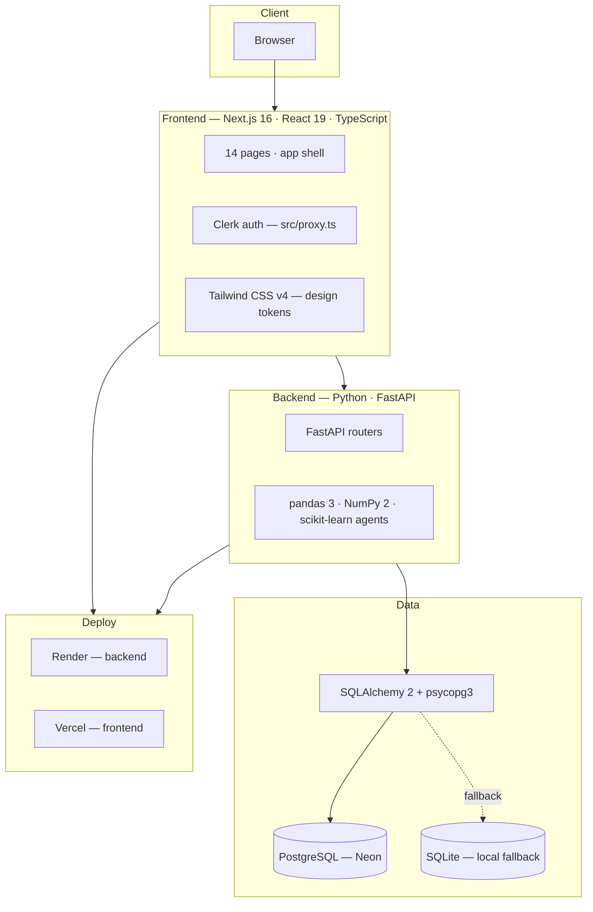

# Tech Stack

Everything a developer needs to know about the tools, exact versions, and why they were
chosen. Versions are pinned from `package.json` and `backend/pyproject.toml`.

---

## 1. Stack at a glance

---

## 2. Frontend

| Technology | Version | Role |
|------------|---------|------|
| Next.js | **16.2.12** | App router, server/client components, `/api` rewrites |
| React | **19.2.4** | UI library |
| React DOM | **19.2.4** | |
| TypeScript | **^5** | Static typing (strict) |
| Clerk (`@clerk/nextjs`) | **^7.6.3** | Authentication, route guard via `src/proxy.ts` |
| Tailwind CSS | **^4** | Utility-first styling, CSS-first config |
| ESLint (`eslint-config-next`) | **^9 / 16.2.12** | Linting |

**Why Next.js 16 + React 19:** the App Router gives file-based routing for the 14 pages,
built-in rewrites for the `/api` proxy, and RSC keeps the shell fast. Clerk's middleware
model fits the new `proxy.ts` guard location required by Next.js 16.

**Charts:** hand-built SVG components (`src/components/charts/`) — area, bars, donut,
gauge, heatmap — avoiding a chart-library dependency and matching the design system.

---

## 3. Backend

| Technology | Version | Role |
|------------|---------|------|
| Python | **≥3.14** | Runtime |
| FastAPI | **≥0.141, <1** | API framework, auto OpenAPI docs |
| Uvicorn | **≥0.34, <1** | ASGI server (`uvicorn[standard]`) |
| pandas | **≥3.0, <4** | Data frames for agent analytics |
| NumPy | **≥2, <3** | Array math |
| scikit-learn | **≥1.9, <2** | IsolationForest, RandomForest, LinearRegression models |
| SQLAlchemy | **≥2.0, <3** | ORM + engine |
| psycopg | **≥3.2, <4** (`psycopg[binary]`) | PostgreSQL driver (psycopg3) |
| pydantic | **≥2.10, <3** | Request/response models |
| python-dotenv | **≥1, <2** | `.env` loading |
| uv | — | Python dependency/project manager (`backend/pyproject.toml`) |

**Agent ML models**

| Agent | Model / algorithm | Purpose |
|-------|-------------------|---------|
| Energy | IsolationForest | hour-level anomaly detection |
| Energy | LinearRegression | 7-day demand forecast |
| Maintenance | RandomForestRegressor | per-asset failure risk (0–99) |
| Occupancy | LinearRegression | per-zone capacity forecast |
| Security | IsolationForest | burst-hour detection |
| Cost | LinearRegression | per-category spend trend / next-month forecast |

---

## 4. Data layer

| Component | Detail |
|-----------|--------|
| Primary database | **PostgreSQL on Neon** (serverless) — shared local + production |
| Local fallback | **SQLite** at `backend/data/facilityops.db` (when `DATABASE_URL` unset) |
| ORM | SQLAlchemy 2.0 (`DeclarativeBase`, `Mapped`/`mapped_column`) |
| Migration model | `Base.metadata.create_all()` on startup (no Alembic — schema is create-only) |
| Seeding | deterministic synthetic dataset, `SEED = 20260731` |

See [DB_SCHEMA.md](./DB_SCHEMA.md) for the full schema.

---

## 5. Deployment & tooling

| Component | Tool | Detail |
|-----------|------|--------|
| Backend hosting | **Render** | `render.yaml` blueprint: `uv sync --frozen` + `uvicorn app.main:app`, `healthCheckPath: /api/health`, auto-deploy |
| Frontend hosting | **Vercel** | Next.js build from `master`, Clerk env vars, `/api` proxy → `BACKEND_URL` |
| Package manager (JS) | **npm** | |
| Package manager (Python) | **uv** | `backend/pyproject.toml` |

---

## 6. Design system

Dark-first, industrial / facility-control aesthetic:

| Token | Value |
|-------|-------|
| Backgrounds | `#0B1120` (abyss navy) → `#111C33` (panel) → `#1E293B` (elevated) |
| Accents | Electric Blue `#38BDF8` · Signal Green `#34D399` · Amber `#FBBF24` · Alert Red `#F87171` |
| Text | `#94A3B8` (muted) / `#E2E8F0` (primary) |
| Fonts | Inter (UI) + JetBrains Mono (data/numerics) |
| Shape | 12px cards, 8px controls, subtle 1px slate borders + soft glow |

## Related

- [ARCHITECTURE.md](./ARCHITECTURE.md) — how the stack fits together
- [DEPLOYMENT.md](./DEPLOYMENT.md) — how to run and ship it
