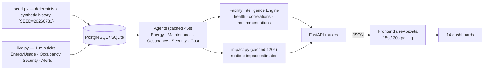

# Workflow

How data moves through the system, how the 14 pages map to endpoints, the daily
development loop, and how to extend the platform safely.

---

## 1. End-to-end data flow



**Data provenance rule:** every number on screen is computed by an agent from database
rows. Configuration (tariffs, targets, thresholds) is a *constant* in those formulas, never
a pinned KPI. The topbar "Sample Data" badge (driven by `/api/health` →
`app.sample_data_note`) labels the synthetic source.

**User data entry** (`POST /api/assets`, `POST /api/energy`, `POST /api/facilities`) writes
rows into the same tables the agents read — a user-entered asset or reading flows through
the identical cached agent pipeline as seeded history, and the relevant agent cache is
invalidated so dashboards update immediately.

---

## 2. Page → endpoint map

| Page | Route | Backend endpoint |
|------|-------|------------------|
| Sign in / Sign up (Clerk) | `/sign-in` · `/sign-up` | Clerk hosted |
| Facility Operations Dashboard | `/` | `GET /api/dashboards/overview` |
| Energy Dashboard | `/energy` | `GET /api/dashboards/energy` · `POST /api/energy` |
| Maintenance Dashboard | `/maintenance` | `GET /api/dashboards/maintenance` |
| Occupancy Dashboard | `/occupancy` | `GET /api/dashboards/occupancy` |
| Security Dashboard | `/security` | `GET /api/dashboards/security` |
| Cost Optimization Dashboard | `/cost` | `GET /api/dashboards/cost` |
| Facility Intelligence | `/intelligence` | `GET /api/dashboards/intelligence` |
| Alerts & Notifications | `/alerts` | `GET /api/dashboards/alerts` · `GET /api/alerts` · `PATCH /api/alerts/{id}` |
| Executive Reporting | `/reports` | `GET /api/dashboards/reports` |
| Assets Management | `/assets` | `GET /api/dashboards/assets` · `GET /api/assets` · `POST /api/assets` · `GET /api/assets/{id}` |
| Work Orders | `/work-orders` | `GET /api/dashboards/work-orders` · `GET /api/work-orders` · `POST/PATCH /api/work-orders` |
| Settings & Integrations | `/settings` | `GET /api/settings/*` |
| AI Copilot | `/copilot` | `GET /api/copilot/agents` · `POST /api/copilot/chat` |

> **Global shell:** the topbar facility menu and Settings → Facilities panel use
> `GET/POST /api/facilities` + `POST /api/facilities/{id}/activate`. Every dashboard is
> scoped to the **active facility** (see [API.md](./API.md)).

---

## 3. Live simulation & polling

- **Sim clock** — `advance()` (called on every dashboard/alerts/copilot request) generates
  the missing minute ticks between the last stored row and now. Idempotent per
  `(facility_id, timestamp)`, catch-up capped (default 1440 min), committed once.
- **Weekend model** — a business-day diurnal curve runs every day (weekends included) so
  the demo stays lively year-round.
- **Agent cache** — per-agent payloads cached **45s**; impact estimates **120s**. Warm reads
  ~1–7s; cold full-mesh (overview/reports/intelligence) ~10–20s on Neon.
- **Frontend polling** — dashboards + topbar poll every **15s**; Assets/WorkOrders/Copilot/
  Settings every **30s**. The topbar "Live" badge, 1s clock, and alert bell are the
  liveness indicators.

---

## 4. Daily development loop

```bash
# 1) Backend
cd backend
uv sync
# create backend/.env from backend/.env.example (set DATABASE_URL)
uv run uvicorn app.main:app --reload --port 8000

# 2) Frontend (new terminal)
npm install
cp .env.example .env.local   # add Clerk keys
npm run dev                  # http://localhost:3000
```

Verify:

```bash
curl http://127.0.0.1:8000/api/health        # → {"status":"ok",...}
npx tsc --noEmit                              # frontend type check
npm run lint                                  # ESLint
npm run build                                 # production build (14 routes)
```

**Reseeding the dataset** (wipes everything and regenerates):

```bash
cd backend
uv run reseed.py
```

---

## 5. How to extend

### Add a backend endpoint

1. Open the relevant router in `backend/app/routers/` (or create a new router file and add
   it to `include_routers` in `routers/__init__.py`).
2. If the response needs analytics, add/use an agent `run(session, facility_id) -> dict` in
   `backend/app/agents/` and wrap it in `cached(f"{name}:{facility_id}", 45.0, ...)`.
3. Add a `GET /api/dashboards/<slug>` route for page payloads (they call `advance` first).
4. Document it in [API.md](./API.md).

### Add a new agent

1. Create `backend/app/agents/<name>.py` exposing `run(session, facility_id) -> dict`.
2. Register it in `routers/agents.py` `REGISTRY` and, if it feeds others, wire it into
   the Intelligence Engine / Cost agent as needed.
3. Add a page spec + frontend payload type in `src/lib/api.ts`.

### Add a frontend page

1. Create `src/app/(app)/<slug>/page.tsx` + `src/components/pages/<Name>.tsx`.
2. Add the nav item in `src/lib/nav.ts`.
3. Poll with `useApiData("/api/dashboards/<slug>", fallback, 15000)`.
4. The page is automatically guarded by `src/proxy.ts` (Clerk) — only `/sign-in`, `/sign-up`,
   `/user` are public.

---

## 6. Commit discipline

- **Atomic commits** — one logical change per commit; stage only intended files
  (`git add <paths>`), never `git add -A` blindly.
- **Never commit secrets** — `DATABASE_URL`, Clerk keys, and local env files are gitignored;
  only placeholders go in `.env.example`.
- **Verify before committing** — `npx tsc --noEmit`, `npm run lint`, and a backend health
  check pass.
- **Message style** — conventional prefixes (`feat:`, `fix:`, `docs:`, `chore:`, `refactor:`)
  with a short imperative subject.

## Related

- [API.md](./API.md) — full endpoint reference
- [EDGE_CASES.md](./EDGE_CASES.md) — known behaviors and gotchas
- [DEPLOYMENT.md](./DEPLOYMENT.md) — shipping to Render + Vercel
